  

 

  
  
  

 

  

---

### 🚀 What I'm Building

- 🤖 **Lark Suite bots & automation** — multi-turn chatbots, workflow hooks, third-party API bridges
- 🔗 **Middleware & integrations** — NetSuite ERP, Google Analytics, custom REST APIs
- 🧠 **AI-powered tools** — document extraction, invoice analysis, AI assistants, leads automation
- 🌐 **Full-stack TypeScript apps** — Next.js 14 + PostgreSQL + Redis, auto-deployed via GitHub webhook → Coolify → Traefik

---

### 🐍 Contribution Snake

<picture>
  <source media="(prefers-color-scheme: dark)" srcset="https://raw.githubusercontent.com/rizub/rizub/output/github-contribution-grid-snake-dark.svg">
  <source media="(prefers-color-scheme: light)" srcset="https://raw.githubusercontent.com/rizub/rizub/output/github-contribution-grid-snake.svg">
  
</picture>

---

### 📊 GitHub Metrics

---

### 🤝 Let's Connect

  
  &nbsp;
  

  

